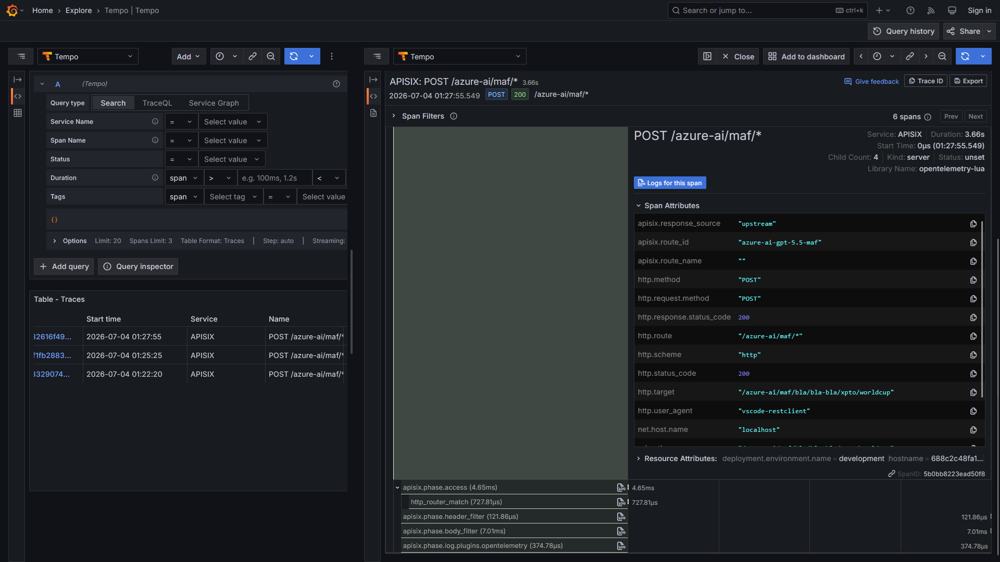
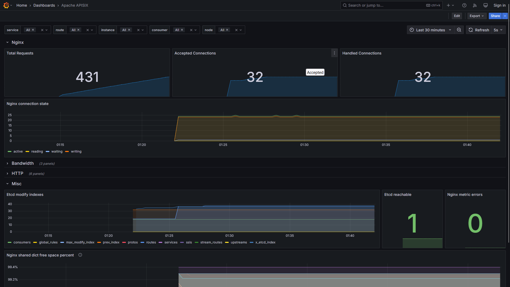

# apisix-ai-gateway-secrets-foundry-otel-grafana-prometheus-dockercompose
Scripts do Docker Compose para subida de um ambiente do APISIX com capacidade de AI Gateway. Inclui monitoramento com Grafana + OpenTelemetry + Prometheus, com geração de traces de requisições direcionadas ao APISIX e coleta de métricas e secrets (environment variables). IA testada: Microsoft Foundry.

Trace gerado durante testes com a rota do ai-proxy:

Dashboard do Grafana para APISIX:

